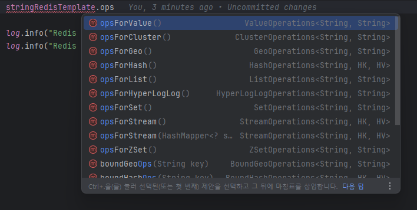

# Spring Boot + Redis

- NoSQL인 Redis 사용해보기

## Dependency

- Spring Web
- Spring Data Redis (Access + Driver)

> redis-server를 띄운 상태

## Properties 설정

> jedis와 lettuce 중 lettuce를 사용하였습니다.   
> [향로님 - Jedis 보다 Lettuce 를 쓰자](https://jojoldu.tistory.com/418)

```properties
spring.data.redis.host=localhost
spring.data.redis.port=6379
spring.data.redis.password=
spring.data.redis.lettuce.pool.max-idle=8
spring.data.redis.lettuce.pool.min-idle=0
spring.data.redis.lettuce.pool.max-active=8
spring.data.redis.lettuce.pool.max-wait=-1
```

## RedisTemplate

- RedisTemplate을 사용하여 Redis 서버에 저장되어있는 데이터를 조작할 수 있다.
- RestTemplate과 비슷한 역할을 하는듯?

_RedisService.java_

```java
package com.f1v3.redis.service;

import lombok.RequiredArgsConstructor;
import lombok.extern.slf4j.Slf4j;
import org.springframework.data.redis.core.StringRedisTemplate;
import org.springframework.data.redis.core.ValueOperations;
import org.springframework.stereotype.Service;

@Slf4j
@Service
@RequiredArgsConstructor
public class RedisService {

    private final StringRedisTemplate stringRedisTemplate;

    public void getRedisStringValue(String key) {

        ValueOperations<String, String> stringStringValueOperations = stringRedisTemplate.opsForValue();
        log.info("Redis kye = {}", key);
        log.info("Redis value = {}", stringStringValueOperations.get(key));
    }
}

```
- `StringRedisTemplate`을 사용하여 다양한 타입의 자료구조를 다룰 수 있다.



- 위와 같은 메서드를 통해 직렬화 및 역직렬화를 할 수 있어 유용